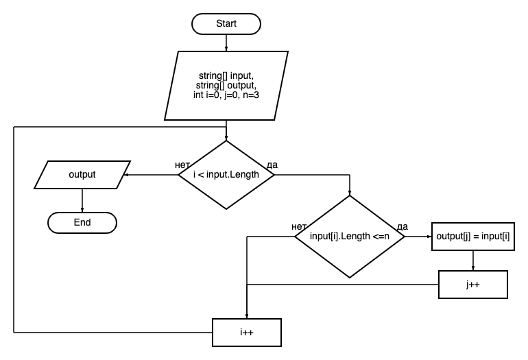

# Final verification work.

## Task:
Write a program that from the existing array of strings forms an array of strings whose length is less than or equal to 3 characters. The initial array can be entered from the keyboard, or set at the start of the algorithm execution. When solving, it is not recommended to use collections, it is better to get by with arrays only.

### Solution algorithm:
1. We enumerate values from the original array
2. We check each value from the array for compliance with the condition: `the length of the string is less than or equal to three`
3. If the string satisfies the condition, put the value in a new array
4. Repeat steps `2` and `3` until we reach the end of the original array
5. Return a new filled array as a result

### Block diagram of the algorithm:


### Program:
To run the program, clone the file (or folder) folder and run the command through the terminal:
```
dotnet run
```
Next, enter the values separated by spaces, for example:
```
Enter values separated by spaces: 2 hello sun 33 world
```
Sample program output:
```
[2, hello, sun, 33, world] -> [2, sun, 33]
```
